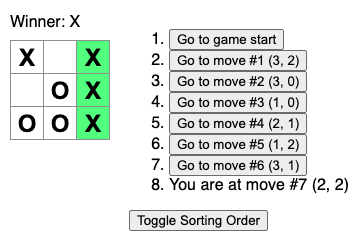

# React Tic-Tac-Toe



## About

This was built following [this tutorial](https://react.dev/learn/tutorial-tic-tac-toe) from React's docs.

This is an interactive tic-tac-toe game. In addition to the primary game functionality, the user can also show past moves.

All five challenges from the end of the tutorial have also been implemented:

> 1. For the current move only, show “You are at move #…” instead of a button.
> 2. Rewrite Board to use two loops to make the squares instead of hardcoding them.
> 3. Add a toggle button that lets you sort the moves in either ascending or descending order.
> 4. When someone wins, highlight the three squares that caused the win (and when no one wins, display a message about the result being a draw).
> 5. Display the location for each move in the format (row, col) in the move history list.

## Usage

### Installation

_These instructions require that you have already installed [Git](https://git-scm.com/downloads) and [Node.js](https://nodejs.org/en/download/package-manager)._

```
git clone https://github.com/TechPandaPro/react-tic-tac-toe.git
cd react-tic-tac-toe
npm install
```

### Running the App

You can start the React app by running `npm start`. The app should then be available at `http://localhost:3000`.
